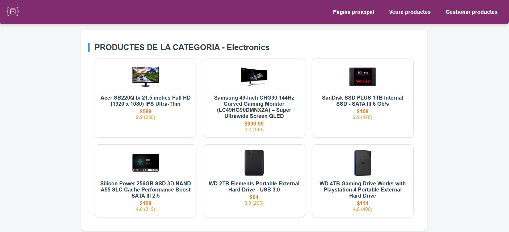

# Fake Store API

Este es un proyecto académico desarrollado para la asignatura de **M7 - Desarrollo en entorno servidor (PHP)** del ciclo formativo de **Desarrollo de Aplicaciones Web (DAW)**. El objetivo es crear una API y una interfaz web para gestionar una tienda ficticia de productos, inspirada en la conocida [Fake Store API](https://fakestoreapi.com/).

## Descripción del proyecto

El proyecto permite consultar, añadir, modificar y eliminar productos de una tienda online, así como visualizarlos por categorías. Está dividido en dos partes principales:

- **Frontend:** Interfaz de usuario desarrollada con HTML, CSS y JavaScript, que permite interactuar con la tienda de forma visual e intuitiva.
- **API Backend:** Backend realizado con PHP y SQLite, que proporciona una API RESTful para gestionar los productos y categorías.

## Funcionalidades principales

- Listado de categorías disponibles.
- Visualización de productos por categoría o de todos los productos.
- Consulta del detalle de un producto.
- Añadir nuevos productos a la tienda.
- Modificar productos existentes (con soporte para PUT y PATCH).
- Eliminar productos.
- Gestión de valoraciones (rating) de cada producto.
- Interfaz de administración para gestionar los productos.
- Navegación sencilla e intuitiva entre las diferentes secciones.

## Estructura del proyecto

- `/api/productes.php`: API REST para gestionar productos y categorías (GET, POST, PUT, PATCH, DELETE).
- `/index.php`: Página principal con el listado de categorías.
- `/veureProductesCategoria.php`: Visualización de productos por categoría.
- `/veureProducte.php`: Detalle de un producto concreto.
- `/gestionarProductes.php`: Gestión (CRUD) de productos.
- `/afegirProducte.php`: Formulario para añadir un nuevo producto.
- `/modificarProducte.php`: Formulario para modificar un producto existente.
- `/includes/`: Fragmentos HTML reutilizables (cabecera, menú, pie de página) y gestión de errores.
- `/screenshots/`: Capturas de pantalla del proyecto.

## Instrucciones de instalación y uso

1. **Clonar el repositorio**
   ```bash
   git clone https://github.com/usuario/fake-fake-store-api.git
   cd fake-fake-store-api
   ```

2. **Asegúrate de tener PHP y SQLite instalados**

3. **Configura la base de datos**
   - Crea la base de datos SQLite y la tabla `productes` según la estructura necesaria (puedes adaptar el archivo de creación si es necesario).

4. **Inicia el servidor local**
   ```bash
   php -S localhost:8000
   ```
   El proyecto estará disponible en [http://localhost:8000](http://localhost:8000).

5. **Accede a la web**
   - Abre el navegador y entra en [http://localhost:8000/index.php](http://localhost:8000/index.php)

## Capturas de pantalla

### Listado de productos por categoría


### Gestión de productos


### Detalle de un producto


## Créditos

Proyecto realizado por **Agustí López** para la asignatura de **M7 (PHP)** del ciclo DAW.

---